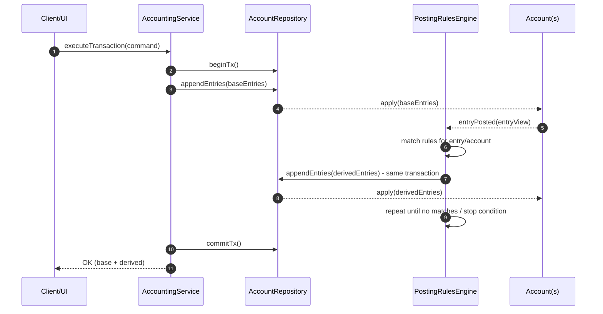
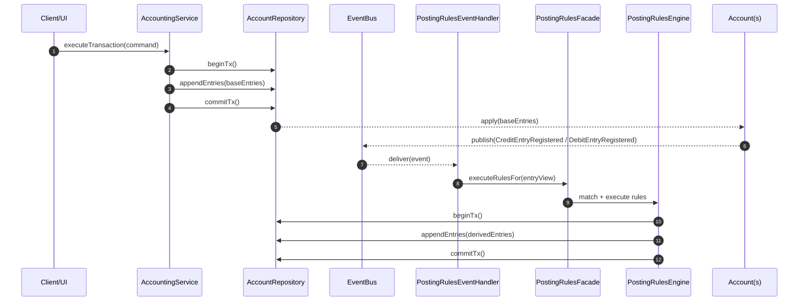
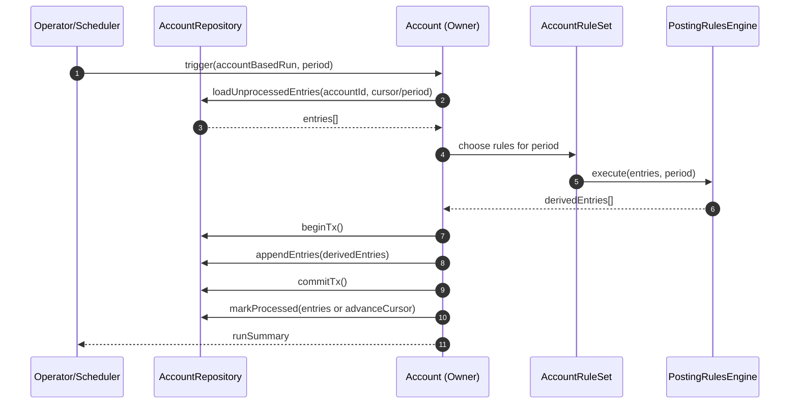
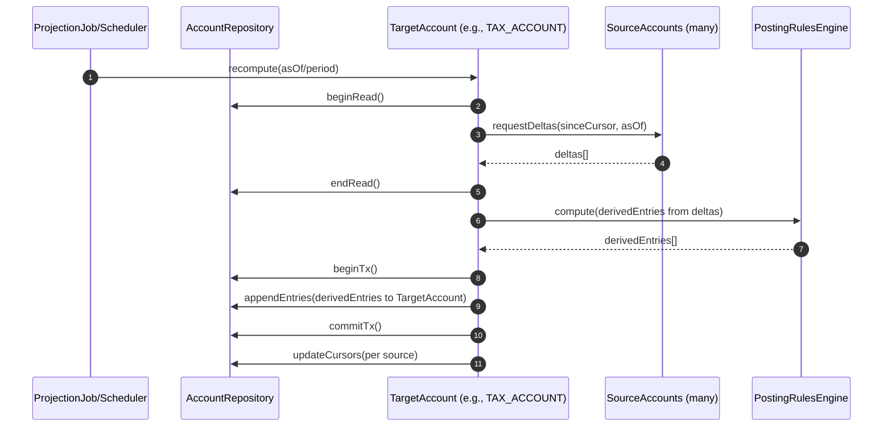
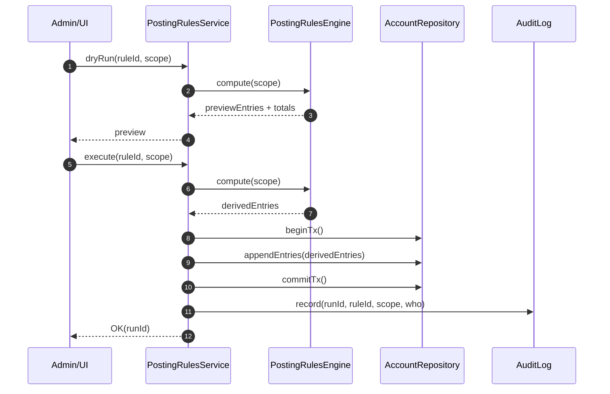

# Module 06: Accounting

## Scope and reading guide

**Central idea:** Accounting models the movement, structure, history, and rules of **value**, not just money. The same
vocabulary can describe currency, data allowances, leave entitlements, inventory, reservations, or parcels.

Read the Bridge Words first, then the lesson summaries. The Java examples are collected in a separate appendix, so the
conceptual summary remains readable. Repeated slide builds are deduplicated, but distinct examples and meaningful model
variants are retained.

## Bridge Words: from business language to Accounting

They are clues for discovering the model, not a mandatory
vocabulary to impose on business users. Polish expressions are retained for matching against the original training;
explanations are in English.

| Business expression          | Possible Accounting interpretation                                                                                       |
| ---------------------------- | ------------------------------------------------------------------------------------------------------------------------ |
| Accrue, assess, charge       | Generate an `Entry`; its direction depends on what is being accrued or charged.                                          |
| Consumption, usage           | Debit a resource account; historical transactions also describe accumulated usage.                                       |
| Use, draw on                 | Execute a transaction consuming value.                                                                                   |
| Grant, award                 | Credit an account holding the granted value.                                                                             |
| Withdraw, cancel             | Record a correction or reverse an earlier posting.                                                                       |
| Block, freeze                | Record a hold or reserve part of the available value.                                                                    |
| Consume an allowance/package | Use allocated value, typically debiting its account.                                                                     |
| Bonus, reward                | A credit generated by a posting rule.                                                                                    |
| Payout, withdrawal           | Transfer value between accounts or systems.                                                                              |
| Refund, return               | Record a reverse-direction transaction. A partial refund is not necessarily a full reversal of the original transaction. |
| Used limit                   | Evaluate the balance or usage against a limit.                                                                           |
| Remaining to use             | Read the relevant balance.                                                                                               |
| Valid until...               | Attach a time-validity attribute to an entry or account.                                                                 |
| Reservation                  | Hold value until settlement, release, or expiry.                                                                         |

The L13 table lists **Consumption** twice, once as a debit and once as a historical usage view; both meanings are combined
above.

**Recognition examples from L13:**

- “The customer has used the package but still has a bonus”: distinguish base and bonus value, their balances, and
  consumption order.
- “An employee earns one day off for every 18 days worked”: derive a credit using a posting rule.
- “After spending exceeds PLN 100, grant 10% cashback”: observe qualifying entries and generate a reward posting.

**Important:** “Debit consumes, credit grants” is a useful convention in the resource examples, not a universal
financial-accounting rule. Debit and credit are posting directions, not intrinsically negative and positive amounts.
Their effect depends on account type and domain policy, as explained in L03.

### Core vocabulary and relationships

| Concept                 | Responsibility                                                                                                 |
| ----------------------- | -------------------------------------------------------------------------------------------------------------- |
| `Money` / `Quantity`    | Amount plus currency or unit, with compatible arithmetic and appropriate precision.                            |
| `Account`               | A meaningful compartment of value and a boundary for account-local rules.                                      |
| `Entry`                 | A historical debit or credit, with identity, amount, times, and optional metadata/validity.                    |
| `Transaction`           | An explicit business operation grouping related entries; validates and executes them as one consistent change. |
| Reversal                | A new transaction with opposite postings, linked to the original rather than deleting it.                      |
| Allocation              | A link recording which source entry a consuming entry uses, and how much.                                      |
| Expiration compensation | A new posting removing or returning the unconsumed part of expired value.                                      |
| Projection account      | A filtered analytical view of existing accounts/entries, not a second movement of value.                       |
| Off-balance account     | An informational or technical account used according to a deliberately chosen domain policy.                   |
| Transaction constraint  | A rule over the complete set of transaction entries.                                                           |
| Account rule            | A rule governing an individual account and its new entries.                                                    |
| Posting rule            | A reaction to accounting facts that creates further transactions.                                              |

A typical flow is: **business process -> transaction -> account entries -> updated balances/history -> projections and
optional posting rules**. The business process supplies meaning and calculated amounts; the Accounting component
protects the value model.

## Lesson summaries

### L01. Value in systems: meaning and importance

Value moves in almost every domain: money between bank accounts, parcels between locations, goods through warehouses,
data through telecom allowances, and working time or leave through HR entitlements. A single mutable `amount` can show
**how much**, but not **why**.

The model should answer: **What happened? When? What changed the state? Can we correct it? Can we explain it?** Missing
answers cause support calls, complaints, manual reconciliation, reporting errors, and legal exposure. Accounting
provides a common structure for tracking movements, components, history, corrections, analytics, and reactions. It is a
value-management archetype, not simply invoicing or statutory bookkeeping.

### L02. The real structure of value: components and semantics

The lesson progressively exposes what primitive balance fields cannot express:

| Requirement            | Why the naive approach fails                                                                                             | Modeling direction                                                                                                                           |
| ---------------------- | ------------------------------------------------------------------------------------------------------------------------ | -------------------------------------------------------------------------------------------------------------------------------------------- |
| Current value          | A bare number lacks currency/unit and context.                                                                           | A value object such as `Money`, later `Quantity`.                                                                                            |
| History and causality  | Updating a balance overwrites its explanation. Application logs are not reliably coupled to committed state.             | Persisted, structured changes.                                                                                                               |
| Reliable event history | Emitting a domain event does not prove it corresponds to a committed change.                                             | Durable events, state/publication consistency through Transactional Outbox, and event-sourced or event-driven read models where appropriate. |
| Related changes        | One payment can affect balance, tax, revenue, and bonus in different systems.                                            | Explicit transaction membership, not only a shared `correlationId`.                                                                          |
| Corrections            | Deleting an erroneous operation conceals that it occurred. Domain-specific compensation can spread across many services. | New compensating changes referencing the originals.                                                                                          |
| Time-limited value     | A promotion, monthly budget, or overpayment can expire without a user action.                                            | Validity intervals and consumption allocation.                                                                                               |
| Components             | One amount can contain principal, interest, fees, tax, or restricted bonus funds.                                        | Preserve the components' meanings.                                                                                                           |
| Analysis               | Business questions cross products, accounts, periods, and metadata.                                                      | Structured queries, projections, and separately modeled calculations.                                                                        |
| Consistency            | History may reveal missing money only after the damage.                                                                  | Reject unbalanced operations before committing.                                                                                              |
| Reactivity             | Every new bonus or threshold otherwise needs another ad hoc job/handler.                                                 | Explicit posting rules.                                                                                                                      |

**Two times:** `occurredAt` records when the business occurrence happened; `appliesAt` records when its accounting
effect applies. They may coincide, but are not interchangeable.

**Correlation is not integrity.** An entity ID identifies the subject; a correlation ID groups consequences of an
operation. The latter is useful but cannot enforce completeness, balancing, or successful compensation. A Saga
coordinates local transactions and compensating actions in a distributed process; it does not replace a coherent value
model.

**Examples:** A PLN 1,000 installment may comprise PLN 800 principal, 150 interest, and 50 fees. Posting only PLN 800 +
192 loses PLN 8 and must be rejected. Other examples include a PLN 100 telecom bonus split between restricted data and
main funds, and a PLN 300 energy overpayment split into 250 usable and 50 reserved for adjustments. API Composition and
CQRS can serve read needs, but cannot invent semantics absent from the underlying data.

### L03. Account and Entry: the foundations

**Account** identifies a compartment of value through `AccountId`, a semantic `AccountName`, an `AccountType`, current
`Money` balance, and a version for optimistic concurrency control. Names such as `client:1234:vat` and
`fleet:bonus:october` improve operations and readability; they are not the identity or an integrity mechanism. Avoid
polluting the core with fields for every possible owner, product, loan, or fleet card. Ownership belongs in a
higher-level relationship or supporting model.

**Entry** records one debit or credit with `EntryId`, `AccountId`, amount, `occurredAt`, `appliesAt`, and `MetaData`.
Metadata captures promotion, channel, origin, external reference, or initiator without repeatedly changing the core
schema. Entries are historical facts, not mutable display values.

**Debit/credit semantics matter.** The course's operational convention is debit decreases, credit increases. Classical
accounting instead interprets postings by account category:

| Account category             | Debit    | Credit   |
| ---------------------------- | -------- | -------- |
| Assets, expenses             | Increase | Decrease |
| Liabilities, equity, revenue | Decrease | Increase |

The shown `AccountType` enum is illustrative, not a mandatory universal chart of accounts. The same loan is an asset to
the lender and a liability to the borrower.

**Three Account-Entry designs:**

1. **Independent Entry writes through a service:** lightweight, but account-level invariants and concurrency
   coordination move outside the account.
2. **Account loads its complete history:** convenient access to data, but an unbounded collection makes every write
   expensive.
3. **Recommended: Account validates and collects only new entries.** Load current state, enforce immediate rules, update
   balance, and persist historical entries separately. The account is a small DDD aggregate, not a container for all
   past activity.

Distinguish immediate invariants, such as no overdraft, from historical/process decisions that can run later. Store
entries by account reference and query them independently with pagination/filtering; relational, document, and hybrid
storage remain possible.

### L04. Model value flows with Transaction

A **Transaction** makes a related business operation explicit: identity, type, occurrence/effective times, and entries
grouped by their affected accounts. `TransactionType` records intent such as client payment, fee, or adjustment. During
execution the transaction holds actual `Account` objects and calls their entry-accepting behavior.

Key patterns:

- **CRC (Class-Responsibility-Collaboration):** Transaction coordinates Entry and Account to perform postings.
- **Command:** the transaction encapsulates what to execute; `execute()` is deliberately not public in the slide model.
- **Builder as an internal DSL:** declaratively specify time, type, metadata, debits, and credits while centralizing
  validation.
- **Factory:** `TransactionBuilderFactory` supplies repositories, allocation support, and clock, so every builder has
  the necessary context.

Validation includes account existence, valid dates/amounts/currencies, and applicable transaction constraints. A
business Transaction is a model concept; the application must still provide the corresponding persistence/atomicity
boundary.

**Examples:**

- Transfer PLN 200 from Adam to Martin.
- Loan repayment: debit customer PLN 1,000; credit principal 900, interest 80, fees 20.
- Partial refund after a PLN 369 purchase: debit net revenue 100 and VAT 23; credit the customer wallet 123.

### L05. Reverse transactions without erasing history

An incorrect operation remains a historical fact. Correct it with a **new reversing transaction**: each original credit
becomes an equal debit, and each original debit becomes an equal credit.

Manually rebuilding opposite entries is error-prone. The transaction builder's **`reverting(originalTransactionId)`**
retrieves and reverses the original set, discarding unrelated entries previously added to that builder. A **`refId`**
links the new transaction to what it reverses. Preserve the original, correction, timestamps, and reason/metadata.

- Duplicate loan repayment: restore PLN 1,000 to the customer and reverse the 900/80/20 component credits from the
  duplicate transaction only.
- Cancel an already-issued PLN 123 refund: debit the customer's wallet 123 and restore net revenue 100 plus VAT 23.

A refund can be partial and explicitly constructed. Reversing that refund is a full reversal of the
**refund transaction**, not automatically of the original purchase.

### L06. Expiration, compensation, and allocation

An entry's **Validity** is separate from its occurrence/effective times. The source value object uses the half-open
interval **`[validFrom, validTo)`** and factory methods `always`, `from`, `until`, and `between`. Its “always” range
begins at `Instant.EPOCH`, not at the earliest representable instant.

The lesson develops the solution in stages:

1. **Unused bonus:** PLN 30 is granted for a limited period. If entirely unused, reversing the grant can return all 30
   to the promotion pool.
2. **Partially used limit:** PLN 500 fuel allowance minus PLN 150 consumed leaves **350**, not 500, to expire. Use
   `compensatingExpired(entryId)` and identify the compensation account. The specialized builder returns
   `Optional<Transaction>` because a zero remainder needs no transaction.
3. **Overlapping entitlements:** base limit 500 valid in October plus bonus 200 valid October 15-November 15. A later
   150 debit cannot be assigned to one grant merely because it happened afterward.
4. **Explicit allocation:** record the relationship to the consumed source entry through `appliedTo`; choose the
   allocation policy when creating entries, not retrospectively while reporting.

**Strategies:** FIFO consumes oldest qualifying grants first; LIFO consumes newest first; MANUAL explicitly chooses the
source. Filters narrow candidates by account, debit/credit type, validity, and other needs. At October expiry, the base
allowance has **350 left with FIFO**, but **500 left with LIFO** because the 150 consumption used the bonus instead.
Return/remove that unused base amount through compensating postings, rather than crediting it back into the customer's
spendable allowance.

A scheduler can locate expired entries; the model builds the compensation. The final remaining-amount calculation
follows explicit allocations, replacing the earlier naive “all later entries on this account” query. Allocation policy
could later be configured per account.

### L07. Separate accounts versus entry metadata

A loan installment's principal, interest, and fees can be posted to separate accounts or to separate metadata-tagged
entries on one account. The number of component entries need not change.

| Choice                              | Strengths                                                                             | Costs                                                                                                      |
| ----------------------------------- | ------------------------------------------------------------------------------------- | ---------------------------------------------------------------------------------------------------------- |
| **Multiple semantic accounts**      | Obvious component balances; local rules; natural separation, auditing, and reporting. | More accounts to create, configure, version, and manage.                                                   |
| **One account with tagged entries** | Fewer accounts; flexible categories and analysis dimensions.                          | Stricter metadata discipline, more filtering/grouping/indexing, and more complex component-specific rules. |

Both support configurable routing/classification. Dedicated accounts fit strong audit/compliance and component-local
constraints; metadata fits rapidly changing classifications such as promotions or marketplaces.
**Hybrid designs are normal.** Decide using readability, rule scope, operational complexity, query needs, and regulatory
requirements, not only object count.

### L08. Filtering, analysis, and reads

A **ProjectionAccount** is an identified, named, versioned query over existing entries. Its filter combines an account
predicate with an entry predicate. It owns no new postings, accepts no entries, and does not participate in
transactions.

**Prefer composition over inheritance:** ProjectionAccount shares some descriptive attributes with Account but cannot
fulfill its posting contract. If needed, introduce a small common descriptor interface, not inherited write behavior.
Whether filtering uses Java predicates or SQL is an implementation choice.

**Projection examples:**

- Fleet manager view over all `CLIENT123` fleet-card accounts for total spend, monthly trends, and deviations.
- Telecom view selecting credit entries marked `MOBILE_APP` to analyze app top-ups and campaign effectiveness.

**Selection is not transformation.** Showing an existing `EntryId` with a recalculated amount misrepresents the
historical fact. For example, estimated 5% deposit interest is a new calculation, not a filtered original deposit.

Use an **OFF_BALANCE / memo account** when calculated or informational values need their own entries, identity, times,
and audit trail without directly changing the customer's financial balance. Such accounts can participate in
transactions under an explicitly different balancing policy.

Examples: projected VAT, per-debtor views of joint debt, an energy-bill correction preview, and telecom billing
previews. A projection filters existing facts; a memo account persists distinct informational facts. Do not count
informational duplicates as additional real money or inventory.

### L09. Consistency and validation rules

**Double-entry bookkeeping** prevents unexplained creation/loss of value: participating debit and credit totals must
balance. Under the course's signed convention, their sum is zero. A credit of 500 to a fleet-card limit needs a source;
a 1,000 loan repayment cannot distribute only 980.

**Transaction-level constraints** belong where the whole operation is visible, not inside a single Account or Entry.
`TransactionEntriesConstraint` is a predicate over entry-account pairs with an error message. Check it while
constructing a transaction. Other examples require at least two entries or two distinct accounts; these are separate
requirements, not consequences of a zero sum. The Specification pattern can compose more complex policies.

**Scope the balancing rule:** projections cannot be posted to; informational OFF_BALANCE entries may intentionally be
one-sided. A payout can balance 12,300 between two real accounts while separately recording a 2,300 tax estimate. Do not
force that informational entry into the real-value balancing equation.

Two ways to express applicability:

- Flag on `AccountType`, such as `doubleEntryBookingEnabled`: simple for a small model, but grows into many behavior
  flags.
- **Preferred in the course:** each constraint owns `isApplicable` and selects the relevant account types. This
  separates type classification from policy and allows independent evolution.

**Account-level rules** protect local invariants at `addEntry`: no overdraft, blocked account, required metadata,
allowed amount range, or credit-only entries. Replace a growing collection of fields and `if` statements with
individually testable **`AccountRule` objects**. A factory supplies rule sets; a facade can manage attachment, removal,
versions, active periods, and failure history.

**External decisions have wider scope.** User authorization, customer-wide daily limits, channel restrictions, and legal
holds can require context or a `LimitService`. `AccountRule` is an integration point, not proof that Account alone is
the consistency boundary for these decisions. This lesson is not an implementation of a full rule engine.

### L10. Posting rules and reactive models

A **PostingRule** observes entries, tests eligibility, finds tagged target accounts, and calculates zero or more new
transactions. The facade builds **PostingContext** with triggering entries, clock, and Accounting access. An executor
loads eligible rules, orders them by priority, and executes their resulting transactions.

The configurable rule separates three responsibilities:

- **EligibilityCondition:** composable `and`, `or`, and `negate` predicates.
- **AccountFinder:** resolve destination accounts, fixed or dynamically selected.
- **PostingCalculator:** compute values and build resulting transactions.

Rules have identity, name, and priority; their lifecycle can include versioning, suspension, or validity periods. The
main Java example calculates **23% of income credits** and records it on an off-balance tax account. Other uses include
bonuses, cashback, credit-limit adjustments, and interest.

| Firing strategy      | Suitable use                                                                          | Main trade-off                                                                                            |
| -------------------- | ------------------------------------------------------------------------------------- | --------------------------------------------------------------------------------------------------------- |
| **Eager**            | Derived entries must accompany the original transaction.                              | Immediate atomicity, but larger/slower transactions, tangled debugging, and difficult partial reversals.  |
| **Event-driven**     | React to registered accounting entries; used by the course implementation.            | Separates processing and failures, but effects occur separately and delivery/processing must be reliable. |
| **Account-based**    | Interest, period close, inactivity fees, scheduled/batch work.                        | Control over a period's entries, but processed-entry tracking and batch load must be handled.             |
| **Backward-chained** | Target account asks source accounts for relevant deltas; simulations and projections. | Flexible target-driven processing, but potentially wasteful polling.                                      |
| **Manual**           | Operator-approved actions, testing, administration.                                   | Explicit control, not a replacement for scalable automation.                                              |

These **five** strategies can coexist. The transcript says “four” once but describes all five.

#### Sequence diagrams from the presentation

The following Mermaid transcriptions preserve the participants, message order, and transaction boundaries of the five
original diagrams. Labels are in English; the methods illustrate interactions rather than an additional Java API
contract. Displayed slide numbers differ from PDF page numbers, so both are given.

##### Eager firing: base and derived entries in one transaction

Rules run before the original
transaction commits; the client receives confirmation for both base and derived postings.



##### Event-driven firing: derived entries in a separate transaction

Accounting-entry events reach a
handler, which invokes the facade and rule engine. Derived postings have their own transaction boundary.



The slide's placement of `apply(baseEntries)` after `commitTx()` is retained. This is a conceptual sequence, not a
complete persistence protocol: base postings must be persisted atomically, and reliable publication requires an
appropriate mechanism such as Transactional Outbox. Delivery retries and duplicate-safe processing are not shown.

##### Account-based firing: the owning account initiates a period run

An operator or scheduler triggers the
owning account, which selects unprocessed entries and the rules for a period, then saves the derived postings.



##### Backward-chained firing: the target account pulls source deltas

The target account asks what has
changed in its source accounts, computes its own derived entries, and advances a cursor for each source. The target is a
posting account, not the read-only `ProjectionAccount` from L08.



In both account-based and backward-chained diagrams, progress marking appears after `commitTx()`. A production
implementation must handle failure between posting and checkpointing, using atomic progress updates or duplicate-safe
reprocessing; otherwise a retry can post the same derived value again.

##### Manual firing: preview, execute, and audit

An administrator first requests a dry
run, then explicitly executes the selected rule for a given scope. Execution recalculates the entries, persists them,
and records who initiated the run.



The dry run is a preview, not a reservation or a guarantee of identical execution results if the underlying data
changes. The reliability and checkpointing notes above are implementation clarifications, not extra steps present in the
source diagrams.

#### Rule dependencies and boundaries

**Rules form a directed graph.** A current-account rule moving excess money to savings and a savings rule returning
excess to the current account can loop forever. Fixed source/target IDs permit definition-time cycle detection, for
example DFS. Dynamic target selection needs additional runtime care. Priorities alone do not eliminate cycles.

**Know the boundary:** simple “entry -> reaction” fits Posting Rules. Safeguarding and international-settlement examples
require holds, institutional funds, authorization, external confirmation, and a long-running order lifecycle. Give that
process its own model rather than encoding a state machine in Entry metadata. Likewise, complex billing, tariffs,
segmentation, and pricing belong outside Accounting.

**Persistence:** begin with testable Java implementations; add database configuration for percentages, conditions, and
tags when needed; consider interpreted DSLs only when their dynamism justifies harder testing/debugging.

### L11. Physical and nonfinancial quantities

**Money is a specialized Quantity:** an amount plus a currency, with appropriate precision, rounding, conversion, and
arithmetic. A general Quantity combines amount and unit. Replacing PLN with kilograms need not change the value-flow
model.

The potato warehouse example uses an outside-source account `OFF:INTAKE`, inventory, reservations, and outgoing
accounts. The source gives this sequence, all amounts in kilograms:

| Operation                                  | Outside source | Inventory | Reserved | Cezary outgoing | Krzysztof outgoing |
| ------------------------------------------ | -------------: | --------: | -------: | --------------: | -----------------: |
| Receive Zdzisław's 1,500 kg                |         -1,500 |     1,500 |        0 |               0 |                  0 |
| Reserve 500 for Cezary                     |         -1,500 |     1,000 |      500 |               0 |                  0 |
| Reserve 200 for Krzysztof                  |         -1,500 |       800 |      700 |               0 |                  0 |
| Cezary collects only 100                   |         -1,500 |       800 |      600 |             100 |                  0 |
| Cezary's remaining 400 expires and returns |         -1,500 |     1,200 |      200 |             100 |                  0 |
| Krzysztof collects all 200                 |         -1,500 |     1,200 |        0 |             100 |                200 |

Both reservations are for 24 hours. Allocation identifies which reservation a pickup consumes. Expiry returns only
unused quantity; Krzysztof's fully consumed reservation needs no compensation. Outgoing entries can support
invoicing/logistics, an inventory projection supports capacity planning, and informational reservation accounts can
support staffing.

**Conservation policy must fit the domain:** the technical outside-source account participates in the illustrated
quantity conservation. Its `OFF` name does not justify blindly reusing a financial rule that excludes every off-balance
account from that check. Adapt account classifications and constraint applicability together.

The mathematical intuition is an additive structure within a compatible unit: zero, inverse, associative and commutative
addition. Do not directly add currencies or incompatible dimensions. The lesson's dimensional analogy explains reuse
across kilograms, gigabytes, licences, tickets, and money; it does not provide a complete `Quantity` implementation.

### L12. Accounting's place in the architecture

Accounting is a **generic business capability**, not an operational workflow. It is typically upstream of billing,
purchasing, promotions, loyalty, risk/scoring, and operational processes: those clients decide the business action and
amount, then request explicit accounting transactions.

It can also be downstream of supporting models:

- **Party:** account owners, initiators, counterparties, authorization identity, and audit context.
- **Authorization/approval:** e.g. director approval above PLN 10,000 and board approval above PLN 1,000,000.
- **Limits, holds, tax, or validation providers:** supporting data and decisions used to protect Accounting's own
  boundaries.

Upstream/downstream is relative to a particular relationship. Keep external product/process semantics out of the generic
core. A module that calculates tariffs and promotions should send “book PLN 89.99”, not require Accounting to interpret
sales, legal-enforcement, or product events. Internal reactions to **accounting-entry events** in L10 do not contradict
this boundary.

| Deployment/reuse choice                 | Benefit                                                                                                         | Cost or limitation                                                                                                         |
| --------------------------------------- | --------------------------------------------------------------------------------------------------------------- | -------------------------------------------------------------------------------------------------------------------------- |
| **Shared library**                      | Common implementation and reduced duplicated code.                                                              | Binary/version coupling, ownership coordination, and separate persistence, history, audit, and reporting in every adopter. |
| **Owned service with API and database** | Clear source of truth, accountable team, centralized audit/reporting; lower cognitive load for consuming teams. | Service, team, integration, and operational overhead. The course favors it where value management is a major capability.   |
| **Shared archetype/design knowledge**   | Common concepts and proven boundaries with locally autonomous implementations.                                  | Repeated implementation and a need to maintain conceptual consistency deliberately.                                        |

Loose coupling does not require consuming arbitrary domain events: APIs, asynchronous commands, and Transactional Outbox
can preserve both independence and reliable integration. Do not apply DRY so mechanically that it destroys team
autonomy.

### L13. Accounting through four perspectives

Use the **Bridge Words near the start of this document** to discover Accounting behind business language. Ask:

- Do values change over time, and must every change be recorded?
- Do we need history, audit, and corrections?
- Does “something happened” imply “something must be recorded or settled”?
- Do several processes operate on the same quantities in different contexts?

| Perspective             | What Accounting adds                                                                                        |
| ----------------------- | ----------------------------------------------------------------------------------------------------------- |
| **Analytical/modeling** | Shared language for accounts, entries, transactions, balances, and rules instead of scattered calculations. |
| **Business**            | Explainable balances and revenue, auditable payments/corrections, easier reporting and operational control. |
| **Programming**         | Coherent reusable value mechanics instead of repeated calculations and fragile synchronization.             |
| **Architecture**        | A defined source of truth with explicit dependencies and responsibilities.                                  |

Its value includes lower support and reconciliation costs and improved delivery capability, not just more features.
Accounting is a way to understand and evolve a system, not merely a set of classes.

### S01. Supplementary scene: a telecom data package

A customer needs granted, consumed, remaining, held, and expiring data across potentially several phone numbers. Adding
`remainingDataMegabytes` and a boolean hold to a customer/contract loses the structure of these requirements.

Model GB as value: top-up transfers from an outside pool, usage transfers out of the subscriber's pool, and a hold is
recorded rather than reduced to a flag. Accounts, entries, expiry, and projections provide the needed history and
aggregate view. The scene supplies the domain analogy, not Java implementation.

### S02. Supplementary scene: parcel tracking

A list of statuses and thousands of technical events may still fail to explain a missing parcel. Treat a truck,
warehouse shelf, sorting facility, and parcel locker as accounts; record movements between them as transfers.

The pattern provides an explicit movement history. It does not itself guarantee physical delivery or repair unreliable
event publication; the scene mentions Outbox as a separate integration concern. No Java implementation is present.

## Cross-lesson design checklist

1. **Model value, not just its current total.** Give it units, identity, history, component semantics, and appropriate
   time information.
2. **Keep the core generic.** Product, tariff, customer-segment, and workflow decisions belong outside Accounting;
   submit explicit transactions to it.
3. **Use small write models and rich read models.** An account need not load its entire history to enforce current-state
   rules. Read history separately and build projections.
4. **Make relationships explicit.** Transaction membership, reversal references, and consumption allocations answer
   different questions; a shared correlation ID is not a replacement.
5. **Separate reversal from expiration.** Reverse the original postings to cancel an operation; compensate only the
   unconsumed remainder when validity expires.
6. **Choose account granularity deliberately.** Dedicated accounts favor local rules and auditability; metadata favors
   flexible classification. Hybrid models are valid.
7. **Select versus calculate.** A projection selects existing facts. A memo/off-balance account can store newly
   calculated facts with their own identities and history.
8. **Enforce rules at the right scope.** Transaction-wide balancing, account-local invariants, external
   authorization/limits, and reactive posting rules are distinct responsibilities.
9. **Treat posting rules as a dependency graph.** Choose firing strategies intentionally, preserve traceability, and
   watch for cycles. Long-running processes need their own lifecycle model.
10. **Reuse the model before deciding to reuse the code.** A library, owned service, or independently implemented common
    design has different organizational and operational costs.

### Implementation cautions when applying the examples

These are clarifications for using the teaching snippets, not extra implementations supplied by the course:

- A fluent builder and `execute()` do not themselves provide durable atomicity. Persist the transaction, affected
  balances, entries, and allocations consistently, with appropriate concurrency control. An in-memory object boundary
  alone cannot protect against concurrent writers.
- Balance compatible units/currencies separately; do not add PLN to USD or kilograms to gigabytes without an explicit
  conversion model.
- Account-local validation cannot by itself atomically enforce a customer-wide limit across several accounts or
  services.
- Event-driven execution still requires reliable publication, failure handling, and duplicate-safe processing. The
  course's Transactional Outbox discussion addresses state/publication consistency; asynchronous execution alone is not
  a reliability guarantee.
- The VAT percentages, safeguarding scenario, and account categories illustrate modeling. They are not a complete tax,
  legal, or statutory-accounting specification.

## Java example appendix

### How to read these examples

The excerpts below preserve the Java examples available in the text exports, including rejected designs and meaningful
intermediate stages. Code is grouped by lesson; repeated slide builds and reused baseline examples are cross-referenced
rather than treated as new programs. The potato sequence and other diagram-only examples are covered in the lesson
summaries, not presented as invented Java.

- Each fragment is independent. Repeated `Account`, `Entry`, and `Transaction` definitions show alternatives or
  evolution, not classes to paste together.
- The slides omit imports, constructors, repositories, and several helper APIs. `Clock.now()`, `Money`, and builder
  overloads belong to the illustrated API; in particular `java.time.Clock` has `instant()`, not `now()`.
- Labels identify source omissions, source errors, and layout/quote repairs. Where no body exists, the absence is
  preserved. “Pseudocode” and incomplete statements are not promised to compile.
- Source explanatory comments and slide ellipses are generally moved into prose. No absent algorithm is silently
  supplied.
- Monetary literals and overloads are retained as printed. Production code should choose exact decimal construction and
  explicit currency/rounding policies rather than assuming a `double` literal is exact.

| Lesson        | Available examples                                                                                    |
| ------------- | ----------------------------------------------------------------------------------------------------- |
| L01           | No Java.                                                                                              |
| L02           | Five scalar entity models, currency fields, persist-and-publish top-up.                               |
| L03           | Account skeleton, name/type, Entry/metadata, three Account-Entry arrangements.                        |
| L04           | Transaction, types, builder/factory, transfer, loan repayment, partial refund.                        |
| L05           | Manual inverse, automatic reversals, `refId` extension.                                               |
| L06           | Validity, grant/use/expiry, compensation builder stages, allocation policies and filters.             |
| L07           | No Java; component tables and their source inconsistency are documented.                              |
| L08           | Projection/filter, fleet and app-top-up views, VAT posting fragment.                                  |
| L09           | Balanced/unbalanced examples, constraint variants, account rules, external daily-limit check.         |
| L10           | Rule builder, facade/executor/calculator, configurable rule and predicates, finder/handler skeletons. |
| L11           | `Money.of` expression; the warehouse operations are diagrams, not Java.                               |
| L12           | Billing-to-Accounting builder fragment.                                                               |
| L13, S01, S02 | No Java.                                                                                              |

**Important source inconsistency: amount signs.** The balancing and remainder snippets sum `Entry.amount()` as if debit
amounts are signed. The overdraft snippets subtract `entry.amount()` as if a debit supplies a positive magnitude. The
exported code does not resolve these conventions. Do not combine the fragments unchanged: define a consistent
posting-direction/magnitude convention before implementing either calculation.

### A02. L02: Actual structure and semantics of value

**Java inventory (five independent initial scalar entity examples, one partial extension, one audit example):**

#### A02.1. Bank balance

slides 3 and 6 [partial class, repeated build deduplicated]:

```java
class BankAccount {
    private String accountId;
    private BigDecimal availableBalance;
}
```

#### A02.2. Prepaid customer

slides 3 and 7 [partial class]:

```java
class Customer {
    private String customerId;
    private BigDecimal remainingAmount;
}
```

#### A02.3. Revolving credit

slides 3 and 8 [partial class]:

```java
class CreditLine {
    private String creditLineId;
    private BigDecimal availableCreditLimit;
}
```

#### A02.4. Fleet-card spending limit

slides 3 and 9 [partial class]:

```java
class FleetCard {
    private String fleetCardId;
    private BigDecimal monthlySpendingLimit;
}
```

#### A02.5. Segment revenue

slides 3 and 10 [partial class]:

```java
class CustomerSegmentReport {
    private String customerSegment;
    private BigDecimal monthlyRevenue;
}
```

#### A02.6. Currency extension

slide 12 [two isolated field fragments overlaid onto the `CustomerSegmentReport` slide by PDF layout; **not** asserted
to be members of that report class]:

```java
BigDecimal availableBalanceInPLN;
private String currency;
```

#### A02.7. Persist-and-publish audit alternative

slide 20 [illustrative partial class; source names it `CalendarManager` although its method concerns balances; source
places `@Transactional` on the class; outbox is only a comment in the source, not executable outbox code]:

```java
@Transactional
class CalendarManager {
    void applyTopUp(String userId, BigDecimal amount) {
        BigDecimal oldBalance = balanceRepository.get(userId);
        BigDecimal newBalance = oldBalance.add(amount);
        balanceRepository.update(userId, newBalance);
        events.publish(new BalanceToppedUp(userId, amount, oldBalance, newBalance));
    }
}
```

The source gives no repository/event field declarations or implementation of atomic outbox storage. Slides 5, 16-18, 30,
33-35 contain JSON/log/event illustrations, **not Java**. Slides 39 contain tabular validity records, not Java. No Java
snippets appear in the transcript independently.

### A03. L03: Account and Entry

**Java inventory (nine distinct illustrations; repeated slide builds consolidated):**

#### A03.1. Account skeleton

slides 3/5/7 [partial; `DeviceDao deviceDao` occurs verbatim beside the optimistic-locking version field, apparently
unrelated; not silently corrected]:

```java
class Account {
    private final AccountId accountId;
    private final AccountType type;
    private final AccountName name;
    private final Money balance;
    private DeviceDao deviceDao;
    private final Version version;
}
```

#### A03.2. Semantic name value object

slide 6 [layout line wrap repaired; source omits imports/helper implementations]:

```java
record AccountName(String value) {
    final static String DEFAULT_DELIMITER = ":";

    AccountName {
        checkArgument(StringUtils.isNotBlank(value), "Account name cannot be empty");
    }

    static AccountName of(String value) {
        return new AccountName(value);
    }

    static AccountName compositeFrom(String... components) {
        return compositeFrom(DEFAULT_DELIMITER, components);
    }

    static AccountName compositeFrom(String delimiter, String... components) {
        checkArgument(components != null && components.length > 0, "Account name cannot be built from an empty array");
        Arrays.stream(components).forEach(val ->
            checkArgument(StringUtils.isNotBlank(val), "Account name component cannot be empty"));
        return new AccountName(String.join(delimiter, components));
    }
}
```

#### A03.3. Account classification

slide 8 [source enum has explanatory inline comments, omitted here]:

```java
public enum AccountType {
    ASSET,
    OFF_BALANCE,
    EXPENSE,
    LIABILITY,
    REVENUE
}
```

#### A03.4. Entry contract

slides 10/13 [source does not supply permitted class definitions]:

```java
sealed interface Entry permits AccountDebited, AccountCredited {
    EntryId id();
    AccountId accountId();
    Instant occurredAt();
    Instant appliesAt();
    Money amount();
    MetaData metadata();
}
```

#### A03.5. Metadata carrier

slide 14:

```java
public record MetaData(Map<String, String> metadata) {}
```

#### A03.6. Metadata usage

slide 14 [call only; `MetaData.of` implementation absent]:

```java
MetaData.of("promotionCode", "XMAS2025", "sourceSystem", "crm-system-2");
```

#### A03.7. Independent-entry service

slide 15 [partial class; source's `AccountCredited` constructor order and `clock.now()` are unverified against missing
definitions]:

```java
class AccountingService {
    private final Clock clock;
    private final EntryRepository entryRepository;

    void addCreditEntry(AccountId accountId, Money amount) {
        Entry entry = new AccountCredited(EntryId.generate(), accountId,
            amount, clock.now(), clock.now());
        entryRepository.save(entry);
    }
}
```

#### A03.8. Full-history Account variant

slide 15 [**pseudocode repair**: source constructor has unfinished `Entries entries //and other params)` and comments
standing in for fields; retained only the explicit structurally meaningful operations]:

```java
class Account {
    private final AccountId accountId;
    private final Entries entries;

    Account(AccountId accountId, Entries entries) {
        this.accountId = accountId;
        this.entries = entries;
    }

    void addEntry(Entry entry) {
        entries.add(entry);
    }
}
```

#### A03.9. New-entries-only Account variant

slide 15 [**pseudocode repair**: omitted placeholder `/*other fields but no entries!!!*/` and unspecified fields; not
source-complete]:

```java
class Account {
    private final AccountId accountId;
    private final Entries newEntries;

    Account(AccountId accountId) {
        this.accountId = accountId;
        this.newEntries = Entries.empty();
    }

    void addEntry(Entry entry) {
        newEntries.add(entry);
    }
}
```

### A04. L04: Modeling value flow with transactions

**Java inventory (six distinct examples; animation stages deduplicated):**

#### A04.1. Transaction skeleton

slides 3-5 [partial class; source marks `entries` transient and `execute` intentionally non-public in comments;
annotation not shown]:

```java
public final class Transaction {
    private final TransactionId id;
    private final TransactionType type;
    private final Instant occurredAt;
    private final Instant appliesAt;
    private Map<Account, List<Entry>> entries;

    void execute() {
        entries.forEach(Account::addEntries);
    }
}
```

#### A04.2. Business type literals

slide 3 [call fragments, not a complete class]:

```java
TransactionType.of("CLIENT_PAYMENT");
TransactionType.of("FEE");
TransactionType.of("ADJUSTMENT");
```

#### A04.3. Transfer builder

slide 6 [fragment; account IDs and factory assumed]:

```java
Transaction transaction =
    transactionBuilderFactory.transaction()
        .occurredAt(clock.now())
        .appliesAt(clock.now())
        .withTypeOf(TransactionType.TRANSFER)
        .withMetadata("correlationId", "abc-123")
        .executing()
            .debitFrom(adamAccountId, Money.of("PLN", 200))
            .creditTo(martinAccountId, Money.of("PLN", 200))
        .build();
```

#### A04.4. Factory construction

slide 7 [fragment]:

```java
TransactionBuilderFactory transactionBuilderFactory = new TransactionBuilderFactory(
    accountRepository,
    transactionRepository,
    entryAllocations,
    entryRepository,
    clock
);
```

#### A04.5. Loan repayment builder

slide 9 [slide-layout spacing repaired; no missing declarations invented]:

```java
Transaction txn =
    tbf.transaction()
        .occurredAt(instantNow)
        .appliesAt(instantNow)
        .withTypeOf("LOAN_REPAYMENT")
        .withMetadata("loanId", "loan-555", "source", "LOAN_REPAYMENT")
        .executing()
            .debitFrom(cust123_accountId, Money.of(PLN, "1000.00"))
            .creditTo(cust123_loan792_principal_accountId, Money.of(PLN, "900.00"))
            .creditTo(cust123_loan792_interest_accountId, Money.of(PLN, "80.00"))
            .creditTo(cust123_loan792_fees_accountId, Money.of(PLN, "20.00"))
        .build();
```

#### A04.6. Partial e-commerce return builder

slide 11 [same layout repair; complete purchase transaction is not extracted]:

```java
Transaction txn =
    tbf.transaction()
        .occurredAt(instantNow)
        .appliesAt(instantNow)
        .withTypeOf("RETURN")
        .withMetadata("orderId", "shop-12345", "source", "RETURN")
        .executing()
            .debitFrom(revenue_online_accountId, Money.of(PLN, "100.00"))
            .debitFrom(vat_collected_accountId, Money.of(PLN, "23.00"))
            .creditTo(cust123_wallet_accountId, Money.of(PLN, "123.00"))
        .build();
```

The slide 9 and 11 diagrams additionally show individual entry IDs, a common transaction ID, metadata and posting
timestamps, not additional Java examples. Source inconsistencies: the loan builder uses `loanId=loan-555` while its
account names/diagram refer to loan 792; the refund diagram's final build shows revenue 300 despite a 100 debit from 300
(the correct arithmetic gives 200). The summaries use the transaction amounts rather than that inconsistent final
balance. Both slides refer to additional materials for full transaction sequences; those materials are not present in
`extracted_text/`.

### A05. L05: Reversing transactions while preserving history

**Java inventory (five lesson-specific distinct illustrations, with reused baseline operations):**

#### A05.1. Baseline Transaction skeleton

slide 2, is the **same** code as A04 item 1, not recounted.

#### A05.2. Original transfer

slide 3, is the **same** code as A04 item 3 except factory variable `tbf`, not recounted; the reverse-direction
**manual alternative**, slide 3, is distinct:

```java
Transaction transaction =
    tbf.transaction()
        .occurredAt(clock.now())
        .appliesAt(clock.now())
        .withTypeOf(TransactionType.TRANSFER)
        .withMetadata("correlationId", "abc-123")
        .executing()
            .creditTo(adamAccountId, Money.of("PLN", 200))
            .debitFrom(martinAccountId, Money.of("PLN", 200))
        .build();
```

[This still says `TRANSFER`, lacks `refId` and illustrates the risky hand-written approach, not the recommended
reversal.]

#### A05.3. Recommended generic reversal

slide 4 [fragment]:

```java
Transaction revertingTx =
    tbf.transaction()
        .occurredAt(clock.now())
        .appliesAt(clock.now())
        .withTypeOf(TransactionType.REVERSAL)
        .reverting(initialTransaction.id())
        .build();
```

#### A05.4. Extended Transaction structure

slide 5 [distinct from L04: added `refId`; partial class]:

```java
public final class Transaction {
    private final TransactionId id;
    private final TransactionType type;
    private final TransactionId refId;
    private final Instant occurredAt;
    private final Instant appliesAt;
    private Map<Account, List<Entry>> entries;

    void execute() {
        entries.forEach(Account::addEntries);
    }
}
```

#### A05.5. Loan reversal

slide 8 [the original loan repayment builder repeats A04 item 5; the **new** reversal fragment is]:

```java
Transaction reversal =
    tbf.transaction()
        .occurredAt(instantNow)
        .appliesAt(instantNow)
        .withTypeOf("REVERSAL")
        .withMetadata("loanId", "loan-555")
        .reverting(txn.id())
        .build();
```

#### A05.6. E-commerce refund reversal

slide 12 [the original return builder repeats A04 item 6; the **new** reversal fragment is]:

```java
Transaction reversal =
    tbf.transaction()
        .occurredAt(instantNow)
        .appliesAt(instantNow)
        .withTypeOf("REVERSAL")
        .withMetadata("orderId", "shop-12345")
        .reverting(txn.id())
        .build();
```

The paired before/after entry diagrams on slides 7-9 and 11-13 are visual data, not Java source. The loan reversal has
four inverse postings, the return reversal three; the snippets do not manually enumerate those postings.

### A06. L06: Expiration, compensation and allocation

**Java inventory (13 distinct examples/stages).** Source: `AO_M06L06_prezentacja.txt`; discussion and limitations
checked against `AO_M06L06_transkrypcja.txt` pp. 1-4. Snippets with undeclared context or omitted bodies remain
fragments. Identifiers such as `dec20_00:00` are printed source tokens, not valid Java; they are not silently replaced.

#### A06.1. Entry with validity, and later allocation reference

[slides 4, 6, 15]. Slide 15 is the meaningful later stage, adding `transactionId` and `appliedTo`; it also includes the
earlier validity field. Slide 6 repeats the earlier interface.

```java
sealed interface Entry permits AccountDebited, AccountCredited {
    EntryId id();
    TransactionId transactionId();
    Instant occurredAt();
    Instant appliesAt();
    AccountId accountId();
    Money amount();
    MetaData metadata();
    Validity validity();
    Optional<EntryId> appliedTo();
}
```

#### A06.2. Validity value type and factories

[slide 5, visually interleaved with the Entry interface; repaired by separating the two columns]. Example
`Validity.always()` and `Validity.between(Instant.parse("2025-12-01T00:00:00Z"), Instant.parse("2025-12-31T23:59:59Z"))`
are displayed on repeated slide 6. The latter excludes its end instant, and thus does not cover the final second of 31
December.

```java
record Validity(Instant validFrom, Instant validTo) {
    public static final Validity ALWAYS = new Validity(Instant.EPOCH, Instant.MAX);

    public static Validity until(Instant validTo) {
        return new Validity(Instant.EPOCH, validTo);
    }

    public static Validity from(Instant validFrom) {
        return new Validity(validFrom, Instant.MAX);
    }

    public static Validity between(Instant validFrom, Instant validTo) {
        if (validFrom == null && validTo == null) {
            return ALWAYS;
        }
        if (validFrom == null) {
            return until(validTo);
        }
        if (validTo == null) {
            return from(validFrom);
        }
        return new Validity(validFrom, validTo);
    }

    public static Validity always() {
        return ALWAYS;
    }

    public boolean isValidAt(Instant instant) {
        return !instant.isBefore(validFrom) && instant.isBefore(validTo);
    }

    public boolean hasExpired(Instant instant) {
        return !instant.isBefore(validTo);
    }
}
```

#### A06.3. Telecom bonus grant

[slide 8, repeated and overlaid on slide 8]. Pseudocode because the time identifiers with colons are not Java
identifiers; source comments omitted without changing operations.

```java
Transaction bonusTxn =
    tbf.transaction()
        .occurredAt(dec20_10am)
        .appliesAt(dec20_10am)
        .withTypeOf("PROMO_BONUS")
        .executing()
            .creditTo(customerBonusAccount, Money.of(PLN, "30.00"),
                Validity.between(dec20_00:00, dec27_23:59))
            .debitFrom(marketingPromoPoolAccount, Money.of(PLN, "30.00"))
        .build();
```

#### A06.4. Full reversal of that unused bonus

[slide 8 overlay, separated from grant; layout repair]. The printed code has `.build()` without semicolon. Source timing
inconsistency: `dec27_10am` is earlier than the grant's `dec27_23:59` endpoint, so this snippet illustrates reversal but
not a correctly timed post-expiration trigger.

```java
Transaction reversal =
    tbf.transaction()
        .occurredAt(dec27_10am)
        .appliesAt(dec27_10am)
        .withTypeOf("REVERSAL")
        .reverting(bonusTxn.id())
        .build()
```

#### A06.5. Fleet grant and partial fuel use

[slide 9 repeated, and grant repeated slides 13, 19; column layout repaired]. Same grant also reappears in lesson 09
slide 4. `usageTxn` contains no allocation filter.

```java
Transaction limitTxn =
    tbf.transaction()
        .occurredAt(oct1_08am)
        .appliesAt(oct1_08am)
        .withTypeOf("FLEET_LIMIT")
        .executing()
            .creditTo(fleetCardAccount, Money.of(PLN, "500.00"),
                Validity.between(oct1_00_00, nov1_00_00))
            .debitFrom(promoPoolFleetLimitAccount, Money.of(PLN, "500.00"))
        .build();

Transaction usageTxn =
    tbf.transaction()
        .occurredAt(oct16_noon)
        .appliesAt(oct16_noon)
        .withTypeOf("FUEL_USE")
        .executing()
            .debitFrom(fleetCardAccount, Money.of(PLN, "150.00"))
            .creditTo(fuelSettlementAccount, Money.of(PLN, "150.00"))
        .build();
```

#### A06.6. Compensation invocation

[slide 10]. Fragment: `NOW`, `expiredEntryId`, and offset account are context supplied externally; printed `.build()`
has no terminal semicolon.

```java
Optional<Transaction> compensationTransaction =
    tbf.transaction()
        .occurredAt(NOW)
        .appliesAt(NOW)
        .compensatingExpired(expiredEntryId)
            .withCompensationAccount(offsetAccount.id())
        .build()
```

#### A06.7. Two overloaded builder entry points

[slide 11]. The containing class is not printed.

```java
ExpirationCompensationTransactionEntriesBuilder compensatingExpired(EntryId entryId) {
    Entry entry = findByIdIfExists(entryId);
    return compensatingExpired(entry);
}

ExpirationCompensationTransactionEntriesBuilder compensatingExpired(Entry entry) {
    return new ExpirationCompensationTransactionEntriesBuilder(entry);
}
```

#### A06.8. Compensation sub-builder and naive chronological remainder

[slide 12; source partial]. Source body has a missing generation branch and inconsistent local names: declares
`relatedEntriesTotalAmount`, returns `referencingEntriesTotalAmount`; this is a source typo, not repaired silently. No
generated balancing entries are text-extracted.

```java
public class ExpirationCompensationTransactionEntriesBuilder {
    private final Entry refEntry;
    private Account compensationAccount;

    ExpirationCompensationTransactionEntriesBuilder withCompensationAccount(AccountId accountId) {
        this.compensationAccount = accountRepository.findIfExists(accountId);
        return this;
    }

    public Optional<Transaction> build() {
        Money remainingAmount = calculateRemainingAmount();
        if (remainingAmount.isZero()) {
            return Optional.empty();
        } else {
        }
    }

    private Money calculateRemainingAmount() {
        Money relatedEntriesTotalAmount =
            entryRepository.findEntriesAfter(refEntry)
                .stream()
                .map(Entry::amount)
                .reduce(Money.zero(), Money::add);
        return refEntry.amount().add(referencingEntriesTotalAmount);
    }
}
```

The empty `else` above represents the source's placeholder `generate compensating entries`, not a functioning
implementation; `build()` therefore cannot compile as shown. The slide also says 'other fields'.

#### A06.9. Second overlapping promotional fleet credit

[slides 13, 19; displayed alongside repeated base grant, layout repaired]. Source does not give `.withTypeOf` on this
bonus. Printed `oct15_00_00` to `nov15_00_00`; slide captions alternately say 14 or 15 November.

```java
Transaction bonusTxn =
    tbf.transaction()
        .occurredAt(oct3_08am)
        .appliesAt(oct3_08am)
        .executing()
            .creditTo(fleetCardAccount, Money.of(PLN, "200.00"),
                Validity.between(oct15_00_00, nov15_00_00))
            .debitFrom(promoBudgetAccount, Money.of(PLN, "200.00"))
        .build();
```

#### A06.10. Naive remainder restated in the overlapping-credit case

[slide 14]. Same `findEntriesAfter` expression as item 8, with identical inconsistent
`relatedEntriesTotalAmount`/`referencingEntriesTotalAmount`; retained as a meaningful failure demonstration rather than
another full code copy.

#### A06.11. Allocation choices and FIFO candidate filter

[slides 16 twice and 19]. Two distinct FIFO filter sketches use different account identifiers, and only the first checks
current validity. Slide 19's filter is displayed next to an unchanged usage transaction, never passed to it.

```java
enum EntryAllocationStrategy {
    FIFO,
    LIFO,
    MANUAL
}

EntryAllocationFilter fifo = EntryAllocationFilterBuilder
    .fifo(fuelCardLimitAccount)
    .withTypeOf(AccountCredited.class)
    .withValidityContaining(clock.now())
    .build();

EntryAllocationFilter allocationFilter =
    EntryAllocationFilterBuilder.fifo(fleetCardAccount.id())
        .withTypeOf(AccountCredited.class)
        .build();
```

#### A06.12. Filter-aware transaction entry creation API

[slide 17]. Only signatures and ellipses are supplied, not implementation. Second signature line was wrapped by PDF
layout and is joined here.

```java
public TransactionEntriesBuilder creditTo(AccountId accountId,
    Money amount, EntryAllocationFilter filter) {
    // ...
}

public TransactionEntriesBuilder debitFrom(AccountId accountId,
    Money amount, EntryAllocationFilter filter) {
    // ...
}
```

The `// ...` markers are literal source placeholders, not explanatory additions.

#### A06.13. Reference-based remainder

[slide 18]. This replaces item 8's `findEntriesAfter` with `findEntriesReferencing`. The source still returns the
undeclared `referencingEntriesTotalAmount` instead of its declared `relatedEntriesTotalAmount`; do not treat it as
working code. Full example stage intentionally preserved.

```java
private Money calculateRemainingAmount() {
    Money relatedEntriesTotalAmount =
        entryRepository.findEntriesReferencing(refEntry)
            .stream()
            .map(Entry::amount)
            .reduce(Money.zero(), Money::add);
    return refEntry.amount().add(referencingEntriesTotalAmount);
}
```

### A07. L07: Multiple accounts versus entry metadata

**Java inventory:** 0 Java snippets in either assigned L07 text file. Slide 4 contains a *data table*, not Java. In its
many-account column: `LOAN123:PRINCIPAL` credit 800, `LOAN123:INTEREST` credit 150, `LOAN123:FEE` credit 50,
`CLIENT567:WALLET` debit 1000. In its shared-account column: `CLIENT567:WALLET` credit 1000 with `{component: PAYMENT}`
and three `LOANS:INCOME` debit entries of 800/150/50 with corresponding
`{component: PRINCIPAL|INTEREST|FEE, loanId: 123}`. **Source tension:** that second column labels wallet credit and
income debits, opposite to the first column and to the later lesson 09 repayment code; preserve the table as printed
rather than correcting it into invented code.

### A08. L08: Filtering, projections and off-balance reads

**Java inventory (5 distinct examples/stages).** Source: `AO_M06L08_prezentacja.txt`; `AO_M06L08_transkrypcja.txt` pp.
1-5 provides intent. Code fragments refer to unshown constructors, getters, factories and types.

#### A08.1. Projection structure plus filter

This is an architectural sketch, not a
complete compilable class: fields include uninitialized final `version`, constructors/getters are explicitly omitted in
source. Repaired only by placing the source's record on its own line.

```java
class ProjectionAccount {
    private AccountId accountId;
    private Filter filter;
    private String name;
    private final Version version;

    record Filter(Predicate<Entry> entryFilter, Predicate<Account> accountFilter) {}
}
```

#### A08.2. All five fleet cards

[slide 8; layout joined]. Filter admits all entries on matching fleet card accounts. Source's `ProjectionAccount`
constructor takes three arguments whereas the sketch above also has a `version` field; the constructor implementation is
not extracted.

```java
Filter fleetCardFilter = Filter.just(
    entry -> true,
    account ->
        account.name().endsWith(":CLIENT123") && account.name().startsWith("FLEET:CARD")
);

ProjectionAccount fleetProjection = new ProjectionAccount(AccountId.generate(),
    fleetCardFilter,
    "FLEET:ALL_CARDS:CLIENT123");
```

#### A08.3. Illustrative top-up entry data

[slide 9]. **Pseudocode, not Java**: the presentation displays an
`Entry { amount = 50 PLN, type = CREDIT, metadata = {"channel":"MOBILE_APP", "source":"PROMO"} }` data sketch. No Java
constructor or creation code for this entry is text-extracted.

#### A08.4. Mobile-app credit projection

[slide 9; typographic quote at projection name repaired to ASCII Java quotes]. Filter is by credit, `channel` and
`:WALLET`; although the caption uses `CLIENT123:WALLET`, the printed predicate does **not** restrict account to client
123. It also does not filter on `source=PROMO` despite the illustrative entry carrying it.

```java
Filter mobileAppTopups = Filter.just(
    entry -> entry.isCredit() && "MOBILE_APP".equals(entry.metadata().get("channel")),
    account -> account.name().endsWith(":WALLET")
);

ProjectionAccount topupsViaApp = new ProjectionAccount(
    AccountId.generate(),
    mobileAppTopups,
    "TOPUPS:MOBILE_APP"
);
```

#### A08.5. VAT memo entry alongside balanced cash movement

[slide 13]. Only builder calls are printed, no transaction wrapper; the line-end `OFF_BALANCE` source comment is
expressed here in prose. `Money.of("PLN", 1230)` / `230` parameter form is source-specific and not aligned to the other
lesson's `Money.of(PLN, "...")`; no invented conversion.

```java
debitFrom(clientIncomeAccountId, Money.of("PLN", 1230))
creditTo(checkingAccountId, Money.of("PLN", 1230))
creditTo(taxAccountId, Money.of("PLN", 230))
```

The third credit posts to the off-balance tax account, and is excluded from the balanced subtotal. The slide says 23% of
each payment; 230 is 23% of 1000, not 1230 (23% of 1230 is 282.90). A net-versus-gross tax basis is not explained in the
extracted text. No Java is printed for 5% deposit simulation, debt shares, `CORRECTION_PREVIEW`, `BILLING_PREVIEW`, or
the proposed descriptor/SQL implementations. [slides 10-16; transcript pp. 3-5]

### A09. L09: Model consistency and validation rules

**Java inventory (16 distinct examples/stages).** Source: `AO_M06L09_prezentacja.txt`; meaning checked against
`AO_M06L09_transkrypcja.txt` pp. 1-7. The presentation later labels a slide `M04L09` at slide 13; lesson context and
filename are M06L09.

#### A09.1. Balanced fleet-limit transaction

[slide 4]. Identical grant was already preserved at A06 item 5, so no duplicate block. Source shows 500 PLN credit to
fleet card, 500 PLN debit to promotional pool, with `Validity.between(oct1_00_00, nov1_00_00)`.

#### A09.2. Balanced loan repayment

[slide 5]. This repeats **A04 item 5**, with 900 principal, 80 interest, and 20 fees. It differs from lesson 07's
800/150/50 data table and the missing-8-PLN cautionary illustration [slide 2]. `loanId` metadata says `loan-555`, while
destination account IDs contain `loan792`; this source inconsistency is retained.

#### A09.3. Rejected incomplete grants/payments

[slide 6]. The presentation marks both with X. First is the lesson 06 `limitTxn` with its pool debit removed: +500
unpaired. Second is item 2 above with its 20 PLN fee credit removed: -20 unpaired. These are intentional
counterexamples, not alternative valid implementations.

```java
Transaction limitTxn =
    tbf.transaction()
        .occurredAt(oct1_08am)
        .appliesAt(oct1_08am)
        .withTypeOf("FLEET_LIMIT")
        .executing()
            .creditTo(fleetCardAccount, Money.of(PLN, "500.00"),
                Validity.between(oct1_00_00, nov1_00_00))
        .build();

Transaction txn =
    tbf.transaction()
        .occurredAt(instantNow)
        .appliesAt(instantNow)
        .withTypeOf("LOAN_REPAYMENT")
        .withMetadata("loanId", "loan-555", "source", "LOAN_REPAYMENT")
        .executing()
            .debitFrom(cust123_accountId, Money.of(PLN, "1000.00"))
            .creditTo(cust123_loan792_principal_accountId, Money.of(PLN, "900.00"))
            .creditTo(cust123_loan792_interest_accountId, Money.of(PLN, "80.00"))
        .build();
```

#### A09.4. Initial transaction predicate and zero-sum constraint

[slide 7]. Partial code: `Money` sign semantics assumed, `Money.zero()` available in model; use of `Map<Entry, Account>`
keys also assumes suitable entry identity. No generated implementation for those dependencies.

```java
interface TransactionEntriesConstraint extends Predicate<Map<Entry, Account>> {
    String errorMessage();
}

TransactionEntriesConstraint BALANCING_CONSTRAINT = new TransactionEntriesConstraint() {
    @Override
    public String errorMessage() {
        return "Entry balance within transaction must always be 0";
    }

    @Override
    public boolean test(Map<Entry, Account> entries) {
        Money balance = Optional.ofNullable(entries).orElse(Map.of())
            .entrySet()
            .stream()
            .map(entry -> entry.getKey().amount())
            .reduce(Money.zero(), Money::add);
        return balance.isZero();
    }
};
```

#### A09.5. Transaction construction and builder injection

[slide 8]. Source deliberately omits other validations and field assignment. `checkArgument` origin not shown; no code
demonstrates applying `isApplicable` in construction.

```java
Transaction(TransactionId id, TransactionId refId, TransactionType type,
    Instant occurredAt, Instant appliesAt, Map<Entry, Account> entries,
    TransactionEntriesConstraint constraint) {
    checkArgument(constraint.test(entries), constraint.errorMessage());
}

public TransactionBuilder withTransactionEntriesConstraint(TransactionEntriesConstraint constraint) {
    this.transactionEntriesConstraint = constraint;
    return this;
}
```

#### A09.6. One-sided telecom off-balance tracking

[slide 10]. Source informational comment translated into prose here. Its account must be OFF_BALANCE to satisfy the
later filtered constraint.

```java
Transaction trackBonusUsage =
    tbf.transaction()
        .occurredAt(now)
        .appliesAt(now)
        .withTypeOf("BONUS_USAGE_TRACK")
        .executing()
            .debitFrom(bonusUsageTrackerAccount, Money.of(PLN, "10.00"))
        .build();
```

#### A09.7. Payout plus off-balance tax projection

[slide 11]. Source calls the account `taxAccount` in code and `taxProjectionAccount` in narration, but this is a posting
account, not a read-only `ProjectionAccount`. The 2,300 tax credit is excluded from balanced subtotal, so 12,300 debit
and 12,300 credit cancel.

```java
Transaction payoutWithTaxProjection =
    tbf.transaction()
        .occurredAt(now)
        .appliesAt(now)
        .withTypeOf("PAYOUT")
        .executing()
            .debitFrom(salaryPoolAccount, Money.of(PLN, "12300.00"))
            .creditTo(employeeMainAccount, Money.of(PLN, "12300.00"))
            .creditTo(taxAccount, Money.of(PLN, "2300.00"))
        .build();
```

#### A09.8. Flag-based `AccountType` alternative

[slide 13; first variant, not final choice]. Its `OFF_BALANCE(false)` marks exclusion.

```java
public enum AccountType {
    ASSET(true),
    OFF_BALANCE(false),
    EXPENSE(true),
    LIABILITY(true),
    REVENUE(true);

    private final boolean doubleEntryBookingEnabled;

    AccountType(boolean doubleEntryBookingEnabled) {
        this.doubleEntryBookingEnabled = doubleEntryBookingEnabled;
    }

    boolean isDoubleEntryBookingEnabled() {
        return doubleEntryBookingEnabled;
    }
}
```

#### A09.9. Flag-filtered balance predicate stage

[slide 13]. Same constraint as item 4 except filtered entries and `Money.zeroPln()`; the presentation supplies a `test`
override inside an anonymous constraint, but does not reprint its `errorMessage` implementation. It is a fragment, not a
full replacement class.

```java
@Override
public boolean test(Map<Entry, Account> entries) {
    Money balance = Optional.ofNullable(entries).orElse(Map.of())
        .entrySet()
        .stream()
        .filter(entry -> entry.getValue().type().isDoubleEntryBookingEnabled())
        .map(entry -> entry.getKey().amount())
        .reduce(Money.zeroPln(), Money::add);
    return balance.isZero();
}
```

#### A09.10. Plain account-type alternative

[slide 14]. This replaces item 8 when applicability lives in the rule. It restores the plain enum already shown in
**A03 item 3** (`ASSET`, `OFF_BALANCE`, `EXPENSE`, `LIABILITY`, `REVENUE`); the slide adds only an optional trailing
semicolon.

#### A09.11. Self-selecting balance constraint stage

[slide 15]. The presentation wraps these methods in an anonymous `TransactionEntriesConstraint`, with `errorMessage`
only as a placeholder; it does not update the earlier interface to declare `isApplicable`. `@Override` therefore needs
an unshown interface revision. `isApplicable` checks for any balance account; `test` omits OFF_BALANCE from total.

```java
@Override
public boolean test(Map<Entry, Account> entries) {
    Money balance = Optional.ofNullable(entries).orElse(Map.of())
        .entrySet()
        .stream()
        .filter(entry -> isBalanceAccount(entry.getValue().type()))
        .map(entry -> entry.getKey().amount())
        .reduce(Money.zeroPln(), Money::add);
    return balance.isZero();
}

@Override
public boolean isApplicable(Map<Entry, Account> entries) {
    return entries.values().stream().anyMatch(account -> isBalanceAccount(account.type()));
}

private boolean isBalanceAccount(AccountType type) {
    return switch (type) {
        case ASSET, LIABILITY, REVENUE, EXPENSE -> true;
        case OFF_BALANCE -> false;
    };
}
```

Source `test` tolerates null entries, but `isApplicable` does not. Transaction constructor item 5 always calls `test`
and does not show conditional applicability.

#### A09.12. At least two entries constraint

[slide 17]. Distinct from balancing and from requiring two accounts.

```java
TransactionEntriesConstraint MIN_2_ENTRIES_CONSTRAINT = new TransactionEntriesConstraint() {
    @Override
    public String errorMessage() {
        return "Transaction must have at least 2 entries";
    }

    @Override
    public boolean test(Map<Entry, Account> entries) {
        return Optional.ofNullable(entries).orElse(Map.of()).size() >= 2;
    }
};
```

#### A09.13. At least two involved accounts constraint

[slide 17].

```java
TransactionEntriesConstraint MIN_2_ACCOUNTS_INVOLVED_CONSTRAINT = new TransactionEntriesConstraint() {
    @Override
    public String errorMessage() {
        return "Transaction must involve at least 2 accounts";
    }

    @Override
    public boolean test(Map<Entry, Account> entries) {
        return new HashSet<>(Optional.ofNullable(entries).orElse(Map.of()).values()).size() >= 2;
    }
};
```

#### A09.14. First, hard-coded account-local validation alternative

[slide 20]. Source's account fields and checks preserved; no concrete insertion/balance-update code is supplied. Note
source calls `entry.amount()` positive in the overdraft subtraction despite the model's signed debit convention, a
potential sign mismatch not resolved in this text.

```java
private boolean overdraftPossible;
private boolean blocked;
private Map<String, String> requiredMetadata;
private Money minEntryAmount;
private Money maxEntryAmount;

public void addEntry(Entry entry) {
    if (this.blocked) {
        throw new IllegalStateException("Account is blocked");
    }
    if (!entry.metadata().keySet().containsAll(requiredMetadata.keySet())) {
        throw new IllegalArgumentException("Missing metadata: " + requiredMetadata.keySet());
    }
    if (entry.amount().isLessThan(minEntryAmount) || entry.amount().isGreaterThan(maxEntryAmount)) {
        throw new IllegalArgumentException("Amount out of bounds");
    }
    if (!overdraftPossible && entry.isDebit() && this.balance.subtract(entry.amount()).isNegative()) {
        throw new IllegalArgumentException("Overdraft not allowed");
    }
}
```

#### A09.15. Composable account rules plus two local implementations

[slides 21-22]. PDF smart closing quotes in exception messages repaired to ordinary quotes. `Account.addEntry`'s actual
insertion is not supplied. These examples are separate implementations of the same interface; both preserved.

```java
public class Account {
    private final List<AccountRule> rules;

    public void addEntry(Entry entry) {
        for (AccountRule rule : rules) {
            rule.validate(this, entry);
        }
    }
}

public interface AccountRule {
    void validate(Account account, Entry entry);
}

public class NoOverdraftRule implements AccountRule {
    public void validate(Account account, Entry entry) {
        if (entry.isDebit()
            && account.balance().subtract(entry.amount()).isNegative()) {
            throw new IllegalArgumentException("Insufficient funds");
        }
    }
}

public class CreditOnlyRule implements AccountRule {
    public void validate(Account account, Entry entry) {
        if (entry.isDebit()) {
            throw new IllegalArgumentException("Only credit entries allowed");
        }
    }
}
```

#### A09.16. External-service daily-limit rule

[slide 26]. Fragment: `LimitService` and its implementation are not printed. This checks `account.id()`,
`entry.amount()` and literal `DAILY`, not the wider context or all accounts explicitly.

```java
public class DailyLimitRule implements AccountRule {
    private final LimitService limitService;

    public void validate(Account account, Entry entry) {
        if (!limitService.canProceed(
                account.id(),
                entry.amount(),
                "DAILY")) {
            throw new IllegalStateException("Daily limit exceeded");
        }
    }
}
```

### A10. L10: Posting rules and reactive models

**Java inventory, distinct excerpts.** The fragments below reconstruct line wrapping only. Slides 10, 12 and 14 repeat
the same `ConfigurablePostingRule` build; represented once at its complete stage. Slide 7 isolates the `execute` method
already included in that class, retained as a meaningful intermediate stage. Source comments standing for missing code
are identified in prose rather than filled in.

#### A10.1. VAT rule builder

slide 4:

```java
PostingRule rule = PostingRuleBuilder
        .createRule("VAT calculation")
        .when(accountEquals(incomeAccount).and(entryTypeEquals(CREDIT)))
        .calculateUsing(new PercentageCalculator(Percentage.of(23)))
        .transferTo("target", vatTargetAccount)
        .build();
```

#### A10.2. Facade

slide 5 (source omits other dependencies, methods and class members):

```java
public class PostingRulesFacade {
    private final AccountingFacade accountingFacade;
    private final PostingRuleExecutor postingRuleExecutor;
    private final Clock clock;

    public Result<String, Set<TransactionId>> executeRulesFor(List<EntryView> triggeringEntries) {
        PostingContext context = new PostingContext(triggeringEntries, accountingFacade, clock);
        return postingRuleExecutor.executeEligibleRules(context, accountingFacade::execute);
    }
}
```

#### A10.3. Executor

slide 6 (source omits the implementation of `execute`, other methods, and constructor):

```java
class PostingRuleExecutor {
    private final PostingRuleRepository postingRuleRepository;

    public Result<String, Set<TransactionId>> executeEligibleRules(
            PostingContext context,
            Function<Transaction, Result<String, TransactionId>> transactionExecutor) {
        List<PostingRule> rules = postingRuleRepository.findEligibleRules(context).stream()
                .sorted(Comparator.comparing(PostingRule::priority))
                .toList();
        return execute(rules, context, transactionExecutor);
    }
}
```

#### A10.4. Rule `execute` intermediate slide build

slide 7. The method tests eligibility, finds target accounts, and delegates to the calculator, otherwise returning
`List.of()`. Its full code appears inside **A10 item 6**; this is not a separate algorithm.

#### A10.5. Percentage calculator

slide 8 (only line-wrap/layout repaired; `creditTo` produces the illustrated transaction, no invented balancing entry):

```java
class PercentageCalculator implements PostingCalculator {
    private final Percentage rate;

    PercentageCalculator(Percentage rate) {
        this.rate = rate;
    }

    @Override
    public List<Transaction> calculate(TargetAccounts accounts, PostingContext context) {
        AccountView targetAccount = accounts.getRequired("target");
        Money totalAmount = context.triggeringEntries().stream()
                .map(EntryView::amount)
                .reduce(Money.zero(), Money::add);
        Money calculatedAmount = totalAmount.multiply(rate);
        return List.of(
                context.accountingFacade().transaction()
                        .occurredAt(context.executionTime())
                        .appliesAt(context.executionTime())
                        .withTypeOf("percentage_allocation")
                        .executing()
                            .creditTo(targetAccount.id(), calculatedAmount)
                        .build()
        );
    }
}
```

#### A10.6. Configurable rule

slides 10/12/14 (repeated slide builds; constructors/getters absent in source):

```java
class ConfigurablePostingRule implements PostingRule {
    private final PostingRuleId id;
    private final String name;
    private final EligibilityCondition eligibilityCondition;
    private final AccountFinder accountFinder;
    private final PostingCalculator postingCalculator;
    private final int priority;

    @Override
    public boolean isEligible(PostingContext context) {
        return eligibilityCondition.test(context);
    }

    @Override
    public List<Transaction> execute(PostingContext context) {
        if (isEligible(context)) {
            TargetAccounts accounts = accountFinder.findAccounts(context);
            return postingCalculator.calculate(accounts, context);
        } else {
            return List.of();
        }
    }
}
```

#### A10.7. Eligibility condition and factories

slide 11:

```java
@FunctionalInterface
public interface EligibilityCondition {
    boolean test(PostingContext context);

    static EligibilityCondition accountEquals(AccountId accountId) {
        return context -> context.triggeringEntries().stream()
                .anyMatch(entry -> entry.accountId().equals(accountId));
    }

    static EligibilityCondition entryTypeEquals(EntryView.EntryType entryType) {
        return context -> context.triggeringEntries().stream()
                .anyMatch(it -> it.type().equals(entryType));
    }

    static EligibilityCondition accountType(String type) {
        return context -> context.triggeringEntries().stream()
                .anyMatch(entry -> {
                    return context.accountingFacade()
                            .findAccount(entry.accountId())
                            .map(account -> account.type().equals(type))
                            .orElse(false);
                });
    }

    static EligibilityCondition custom(Predicate<PostingContext> predicate) {
        return predicate::test;
    }

    default EligibilityCondition and(EligibilityCondition other) {
        return context -> this.test(context) && other.test(context);
    }

    default EligibilityCondition or(EligibilityCondition other) {
        return context -> this.test(context) || other.test(context);
    }

    default EligibilityCondition negate() {
        return context -> !this.test(context);
    }
}
```

Caution: `accountEquals(...).and(entryTypeEquals(...))` applies separate `anyMatch` calls to the batch, so in a
multi-entry context the account and type may match **different** entries; the source does not assert a same-entry
conjunction.

#### A10.8. Account finder skeleton

slide 13 (source supplies only placeholder comments for both static factory bodies; shown as pseudocode signatures, not
working Java):

```text
public interface AccountFinder {
    TargetAccounts findAccounts(PostingContext context);
    static AccountFinder fixed(String tag, AccountId accountId) { [find through context.accountingFacade()] }
    static AccountFinder fixed(Map<String, AccountId> accountIds) { [find all through context.accountingFacade()] }
}
```

#### A10.9. Calculator contract

slide 15:

```java
public interface PostingCalculator {
    List<Transaction> calculate(TargetAccounts accounts, PostingContext context);
}
```

#### A10.10. Event handler

slide 20 (source uses `EntryView entryView = // build ...` placeholders; the marked two assignments below are
pseudocode, and the slide's pattern switch is not silently completed with additional cases):

```text
class PostingRulesEventHandler implements EventHandler {
    private final PostingRulesFacade postingRulesFacade;

    @Override
    public void handle(PublishedEvent event) {
        if (event instanceof AccountingEvent accountingEvent) {
            switch (event) {
                case CreditEntryRegistered creditEvent -> handleEntryEvent(creditEvent);
                case DebitEntryRegistered debitEvent -> handleEntryEvent(debitEvent);
            }
        }
    }

    private void handleEntryEvent(CreditEntryRegistered event) {
        EntryView entryView = [build credit entry view];
        postingRulesFacade.executeRulesFor(List.of(entryView));
    }

    private void handleEntryEvent(DebitEntryRegistered event) {
        EntryView entryView = [build debit entry view];
        postingRulesFacade.executeRulesFor(List.of(entryView));
    }
}
```

The `accountingEvent` binding appears in the slide but the switch uses `event`; retained as printed, not normalized.

### A11. L11: Accounting for physical and nonfinancial quantities

**Distinct extracted example stages.** Slides 9-19 are a *diagram/table*, not Java. They show intake debit/credit 1500
(slide 9), Cezary reservation debit inventory/credit reserved 500 with `Validity` (slides 11-14), Krzysztof reservation
200 (slide 15), Cezary pickup debit reserved/credit outgoing 100 with `AppliedTo` (slide 16), expiry debit
reserved/credit inventory 400 with `RefId` (slide 17), Krzysztof pickup debit reserved/credit outgoing 200 (slides
18-19). Slide 11 still displays a partial build (inventory 1000, reserved not yet updated); do not treat each repeated
build as a new transaction. Slide 18 still shows balances before the displayed pickup, slide 19 after. No Java for these
transactions is text-extracted.

#### A11.1. Money expression

slide 3, transcript p. 1 (standalone Java expression, not a class):

```java
Money.of("PLN", 100)
```

The slide's `Quantity: 5 kg` / `Money: 100 PLN` and `Quantity(5, “kg”) → 5 × [M]` are conceptual dimensional notation,
not additional Java implementations. Slide 21's `Money("PLN", 100) + Money("USD", 50)` is an explicitly rejected
conceptual operation, **not valid Java source** and not an allowable addition; preserved here rather than repaired into
invented constructors/operators.

### A12. L12: Accounting's place in system architecture

#### A12.1. Billing-to-Accounting transaction builder fragment

slide 7 (no terminal build/execute call appears in the text):

```java
transactionBuilder()
    .debitFrom(customerId, Money.of("PLN", 89.99))
    .creditTo(revenueAccount, Money.of("PLN", 89.99))
```

This is a slide fragment, not a complete Java statement; `customerId` is retained as printed, with no inferred account
conversion.
